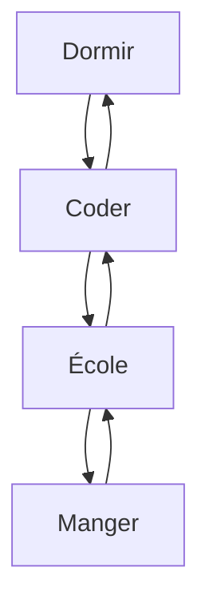

## 👤 Matdbx10 | Mathieu

 Mon prénom est Mathieu. 🧭   
Je travaille comme Directeur au sein du serveur Arkalis depuis maintenant 5 ans. 💼   
Je suis Développeur depuis maintenant plus de 4 ans ! 👨‍💻

## 🌐 My Discord Server

                                             █████╗ ██████╗ ██╗  ██╗ █████╗ ██╗     ██╗███████╗
                                            ██╔══██╗██╔══██╗██║ ██╔╝██╔══██╗██║     ██║██╔════╝
                                            ███████║██████╔╝█████╔╝ ███████║██║     ██║███████╗
                                            ██╔══██║██╔══██╗██╔═██╗ ██╔══██║██║     ██║╚════██║
                                            ██║  ██║██║  ██║██║  ██╗██║  ██║███████╗██║███████║
                                            ╚═╝  ╚═╝╚═╝  ╚═╝╚═╝  ╚═╝╚═╝  ╚═╝╚══════╝╚═╝╚══════╝
                                                   
                                                  Ｄ Ｓ Ｃ ． Ｇ Ｇ ／ Ａ Ｒ Ｋ Ａ Ｌ Ｉ Ｓ 

 
## 💻 Tech Stack:
       
## 📊 GitHub Stats
 
 

## 🏆 GitHub Trophies

## ⭐️ Famous Script

## ⏰ My time

## 👀 Profile view

